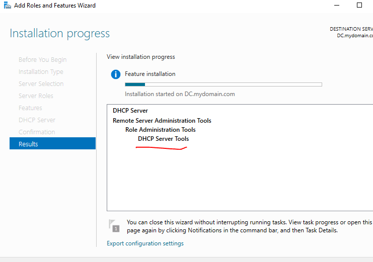

# Active Directory Lab (WIP)

## Objective
The objective of creating an Active Directory lab is to provide a controlled environment for learning and experimenting with Active Directory configurations, security practices, and administrative tasks. This lab allowed me to gain hands-on experience with directory services, improve my understanding of user and group management, and analyze logs for security events, ultimately enhancing my skills in managing and securing an Active Directory infrastructure.

### Skills Learned
- User and Group Management: Create, modify, and manage user accounts and groups within Active Directory.
- Active Directory Configuration: Set up and configure Active Directory Domain Services, including domain controllers and organizational units.
- Group Policy Management: Implement and manage Group Policies to control user and computer settings across the network.
- Authentication and Authorization: Understand and configure authentication mechanisms and authorization settings to secure resources.
- Backup and Recovery: Perform backup and recovery operations to ensure the availability and integrity of Active Directory data.
- Troubleshooting: Diagnose and resolve common Active Directory issues to maintain a healthy and functional directory service.
- Routing and Subnetting: Implement routing to an Active Directory environment and setup the DHCP server along with configuring the subnet mask to be a /24 Network (255.255.255.0)

### Tools Used
- RSAT to Remotely manage the AD Enviornment from the virtual client machine.
- Powershell to use a script to create the fake user accounts.
- AD Users and Computers to manage user accounts, groups and OUs.
- GPMC to create and edit group policies across the virtual network. 

## Steps
I followed along a youtube video to get the virtual AD enviornment set-up 
### Windows server steps!
 Step 1: Network Diagram 
 
 Step 2: Download and configure the Virtual Machine with Windows Server 2019 installed.   
 
 Step 3: Add the server role AD DS (Active Directory and Domain Services.) 
 
 Step: 4: Go to the Dashboard and click on manage and Promote the server to a DC (Domain controller). 
 
 Step 5: Open the ADDS Configuration wizard and add a new forest we will call ours mydomain.com.
 
Step 6: We should see that we are now user: MYDOMAIN\Administrator and if we try and login to another user it will be under mydomain.

Step 7: I created my own user in Active Directory users and Computers and made an organizational unit called _ADMINS.

Step 8: If we want to escalate the privilege of the newly created user we will right click user go properties, and then under the "Member Of" tab we will click add. Finally to add the domain admin privilege we will type in "domain admins" under the field "Enter the object names to select." 

Step 9: We now should be able to login to the newly created user in the domain. 

Step 10: Go to network adapter settings and then give the internal adapter a static IP to act as the server IP for the client machine. Next add a DNS Loopback address so that the machine can use itself to resolve the domain names. (127.0.0.1)

Step 11 (the important one): We are going to set up routing, so were going to go back to add roles and add in remote access and then under the remote access tab were going to click the routing option. This will allow us to use the virtual network adapters to act as a server for our other windows virtual machine(s).

Configuration > After installing the routing service we are going to go to our DC (local) server and configure it with NAT; so that it can act as a NAT adapter to our windows client VM. 

After this you will be prompted to choose a network adapter to act as the DHCP server.  

After that we should be able to right click on our domain controller and click refresh and things should be working. :) ! 

Step 12: We're now going to add the role "DHCP Server", so that we can use the windows server as a DHCP server for our LAN I plan to make a /24 Network (255.255.255.0) After setting your IP you'll need to set the default gateway now under DHCP we should be able to refresh and see that our dhcp scope has been set. 

Step 13: WE HAVE NOW COMPLETED THE BASIC SETUP FOR OUR AD ENVIORNMENT !

Step 14: (optional) : From the video there was a powershell script that I ran to create around 1000 user accounts with random names.  Allowing us to have fake users to simulate a somewhat realistic environment for our lab.

Step 15 (optional): Mess around with some of the features! I messed around with some of the settings and features I used GPMMC to change the group policies to allow them access to files or folders. I also created shared folders so that every computer in the network could access certain important files. Aswell as created a desktop wallpaper for each user.

Step 16 (optional): If your windows machine isn't showing the group policy changes you made through GPMMC you can open cmd as admin and type in, "gpupdate /force" which will force all of the computers to update the group policy. Adhering to the rules that you have newly created. 

### Windows Client Steps 

Step 1: We now need to setup the internal network settings in the virtual machine for our windows client. Which we can do by changing the virtual network adapter from NAT to an internal network. 

Step 2: Make sure that you are connected through the windows server to the internet by opening cmd and typing ipconfig /all. This should show that you have a leased IP from the windows server that will allow to browse the internet. 

Step 3: Join the domain, Go to system poroperties and where it shows your computer name click change workgroup settings and under member of click Domain and then type in the domain name, In my case it would be mydomain.com. 

Step 4: You now should be able to login under any account registered within the domain.

 Here is me using a random account created by the powershell script- 

